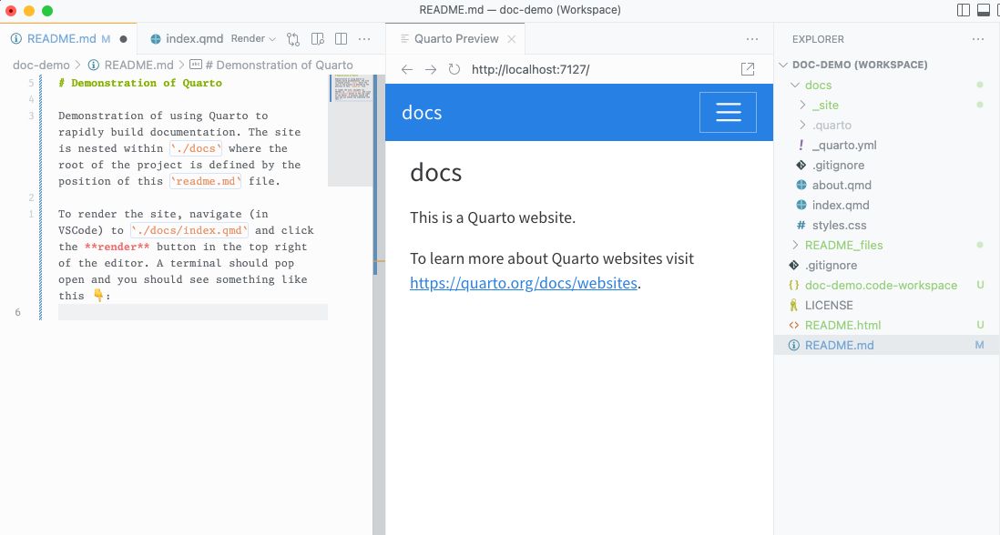

# Demonstration of Quarto

Demonstration of using Quarto to rapidly build documentation. The site is nested within `./docs` where the root of the project is defined by the position of this `readme.md` file.

To render the site, navigate (in VSCode) to `./docs/index.qmd` and click the **render** button in the top right of the editor. A terminal should pop open and you should see something like this 👇:

Your `.gitignore` has been set-up to exclude the `./docs/_site/` directory since we will use GitHub actions to build directly to [GitHub Pages](https://pages.github.com/) rather than rendering locally and pushing the rendered files to GitHub.
